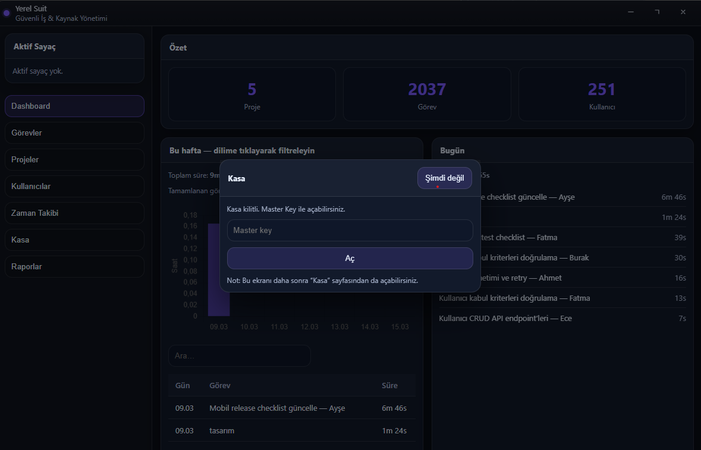
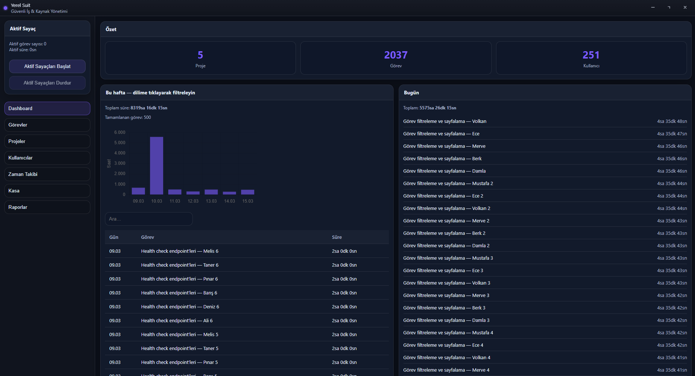
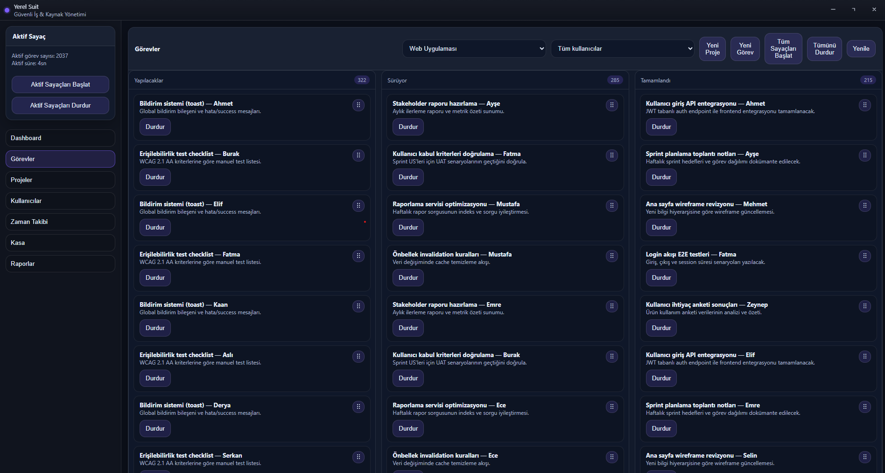
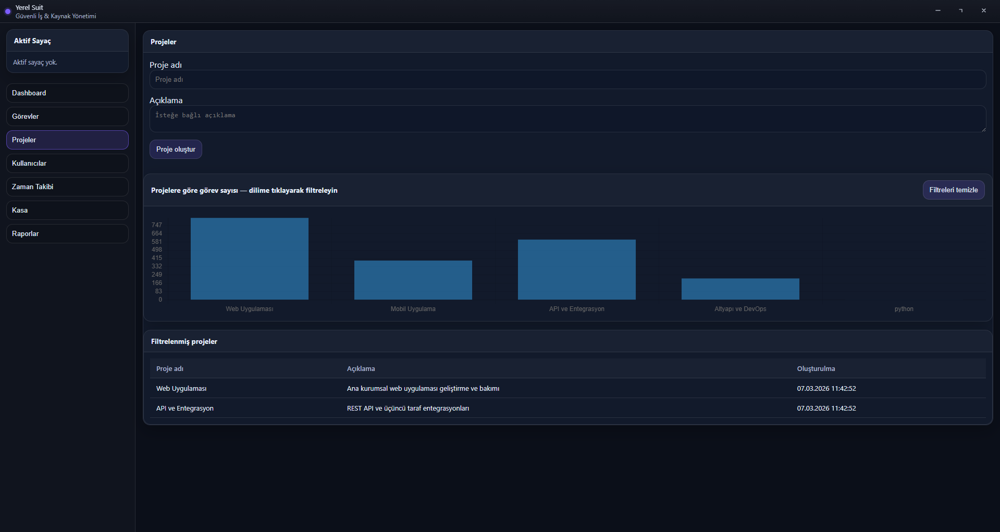
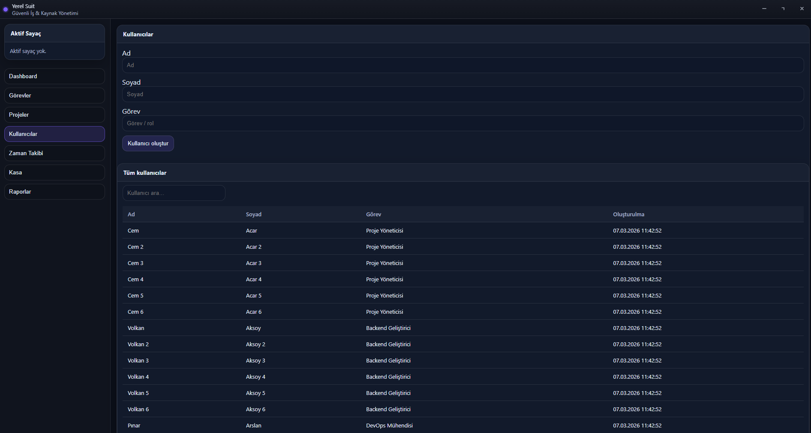
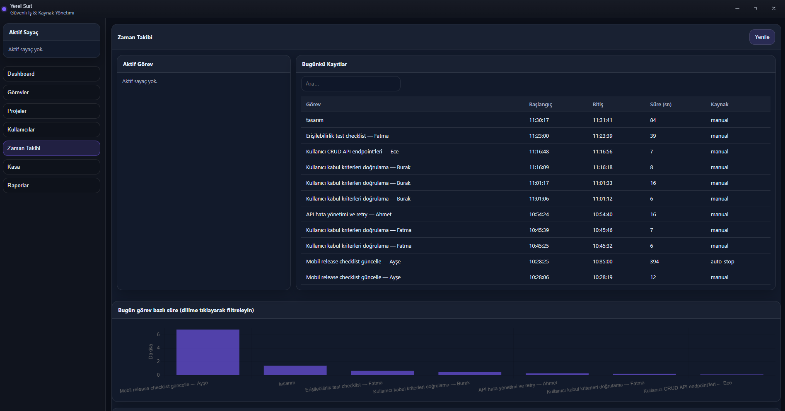
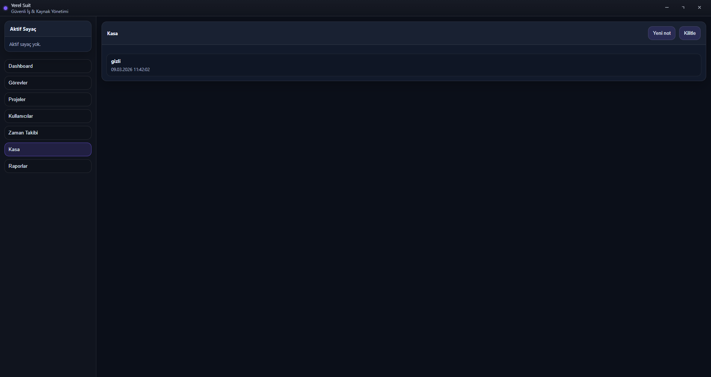
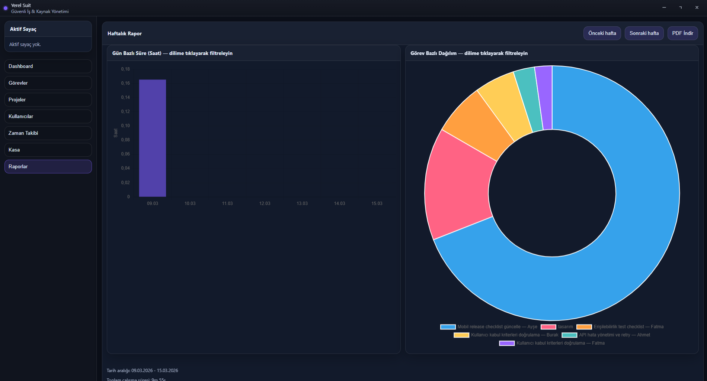

# SecureDesk App (YerelSuit)

Electron, React, TypeScript ve SQLite ile geliştirilen; tamamen yerel çalışan, güvenli bir masaüstü iş ve kaynak yönetim uygulaması.

SecureDesk App; görev yönetimi, zaman takibi, şifreli veri kasası ve haftalık raporlama modüllerini tek bir masaüstü uygulamasında birleştirir. Uygulama internet bağlantısı gerektirmez ve tüm verileri yerel olarak saklar.

## Özellikler

- **Görev Yönetimi (Kanban Board)**
  - Proje bazlı görev oluşturma
  - Sürükle-bırak ile durum değiştirme
  - Yapılacaklar / Sürüyor / Tamamlandı kolonları
  - Görevlere dosya eki ekleme

- **Zaman Takibi**
  - Görev bazlı sayaç başlatma/durdurma
  - Tek aktif sayaç mantığı
  - Hareketsizlik durumunda otomatik durdurma
  - Aktivite loglama

- **Şifreli Veri Kasası**
  - Hassas notları güvenli şekilde saklama
  - AES-256-GCM + PBKDF2 tabanlı şifreleme
  - Master Key ile erişim

- **Raporlama**
  - Haftalık özet ekranı
  - Chart.js ile grafikler
  - PDF dışa aktarma

- **Yerel Çalışma**
  - Tüm veriler yerel SQLite veritabanında tutulur
  - Offline kullanım desteği
  - Electron tabanlı masaüstü mimarisi

---

## Ekran Görüntüleri

### Güvenli Giriş / Master Key


### Dashboard


### Görev Yönetimi


### Projeler


### Kullanıcılar


### Zaman Takibi


### Kasa


### Raporlar


## Teknoloji Yığını

| Alan | Teknoloji |
|---|---|
| Masaüstü Uygulama | Electron |
| Arayüz | React + Vite |
| Dil | TypeScript |
| Veritabanı | SQLite (`better-sqlite3`) |
| Grafikler | Chart.js |
| Paketleme | electron-builder |
| Kod Kalitesi | ESLint, TypeScript strict mode |
| CI/CD | GitHub Actions |

---

## Mimari Özeti

Uygulama üç temel katmandan oluşur:

- **Main Process**
  - Veritabanı erişimi
  - Dosya sistemi işlemleri
  - PDF üretimi
  - System tray ve native notification yönetimi

- **Preload**
  - `contextBridge` üzerinden güvenli API sunar
  - Renderer ile Main arasındaki kontrollü iletişimi sağlar

- **Renderer**
  - React tabanlı kullanıcı arayüzü
  - Görevler, zaman takibi, kasa ve rapor ekranları

> Güvenlik gereği `nodeIntegration: false` ve `contextIsolation: true` kullanılır.

---

## Kurulum

### Gereksinimler

- Node.js 20+
- npm

### Projeyi çalıştırma

```bash
git clone https://github.com/gulkaraman/securedesk-app.git
cd securedesk-app
npm ci
npm run dev
